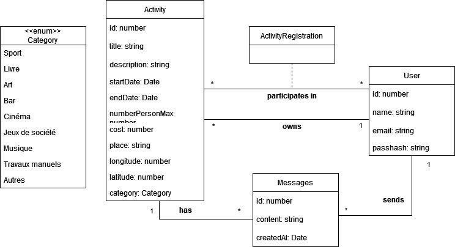

# Documentation du projet

# Objectifs du projets
TODO : à compléter

# Démo 
(screencast)
TODO : à faire

# Installation et exécution des tests
Voir dans les README du frontend et du backend.

# Documentation de l'API
cf. le swagger

# Architecture
## Frontend
TODO : à compléter

## Backend
### Description
L'architecture du backend est largement inspirée de l'architecture hexagonale. Le but principale d'une telle architecture est de concevoir un logiciel modulable, testable et indépendant des systèmes externes (frameworks, UI, BDD, etc.). Pour cela on se repose notemment sur les principes SOLID.

TODO : schéma

#### 1. Domain
Le _domain_ contient les _entities_, c'est-à-dire le modèle des données qu'on va manipuler et les _interfaces_ qui définissent les contrats d'utilisation des systèmes externes.

- Entities/Models :

- Interfaces : 
    - repositories : accès aux tables de la base de données
    - services divers (chiffrage, etc.)

#### 2. Core
Le _core_ contient le coeur de l'application, là où se trouve toute la logique métier. Elle est isolée des dépendances externes et est donc plus facilement testable. Elle est découpée en _use cases_ (cas d'usage) et chacun d'eux représente une fonctionnalité. Le paramétrage se fait via les _entities_ du métier qui vont être manipulés et les _interfaces_ qui permettent de changer d'implémentation en fonction du besoin (par exemple, utiliser des inMemory ou fake lors des tests). Le _core_ contient aussi un répertoire _security_ qui porte sur toute la gestion des règles métiers d'accès aux routes du backend et donc aux _use cases_.

- Use cases :
    - User
        - RegisterUser : Inscrire un utilisateur
        - SignInUser : Connecter un utilisateur
    - Activity :
        - CreateActivity : Créer une activité
        - DeleteActivity : Supprimer une activité
        - GetActivities : Récupérer les activités (toutes ou certaines avec filtres)
        - GetActivitiesByUser : Récupérer toutes les activités liées à un utilisateur (détenteur ou participant)
        - GetActivityById : Récupérer une activité par son id interne
        - UpdateActivity : Mettre à jour une activité
    - ActivityRegistration :
        - RegisterForAnActivity : S'inscrire à une activité (qui n'appartient pas à l'utilisateur)
        - UnregisterForAnActivity : Se désinscrire à une activité (qui n'appartient pas à l'utilisateur)
    - Message :
        - CreateMessage : Créer un message
        - GetLastMessagesByUserId : Récupérer le dernier message envoyé ou reçu de chaque activité de l'utilisateur (détenteur ou participant)
        - GetMessagesByAcivityId : Récupérer tous les messages concernant une activité

- Scénarii d'usage clés :
TODO : diagramme de séquence

- Gestion des utilisateurs :
Dans _security_ on retrouve :
    - les _Actions_ possible pour l'utilisateur : create, read, update, readone, delete
    - les _Resources_ disponibles sur l'application : activity, user, message
    - les _rbacCheckFunctions_ qui contiennent un ensemble de fonctions de vérification de droit d'accès
    - les _rbacRules_ qui sont sous la forme d'un dictionnaire dont la combinaison des _Actions_ et des _Resources_ correspond à une _rbackCheckFunctions_ à exécuter
    - le _can_ où l'on retrouve les fonctions vérifiant l'authentification de l'utilisateur et faisant appel aux _rbacRules_ pour vérfier le droit d'accès. Ces fonctions sont utilisées en tant que middleware sur les routes du backend et sur les listeners des sockets

#### 3. Adapters
Les _adapters_ contient les implémentations répondant aux contrats d'utilisation (_interfaces_) du coeur de notre application.
Il existe deux catégories d'_adapters_ :
- Driving : c'est ce qui réunit les points d'entrée d'une application. Donc on y retrouve dans notre cas les _routes_ de notre API et les _controllers_. Les _interfaces_ de ce cas ne sont pas définit concrètement mais on peut les voir comme les signatures des _use case_. 
- Driven : ce sont les _adapters_ qui seront utilisés par l'application. On y retrouve donc l'accès à la base de données ou encore l'usage de bibliothèques externes.

### Testabilité
#### 1. Tests unitaires (spec)
La portée de ces tests ne s'arrête qu'au use cases (donc une fonctionnalité), c'est pour cela qu'on substitue les implémentations concrètes par des fakes. Leur objectif est de documenter les comportements métiers de notre application à travers des exemples de scénarios. Ils sont aussi indépendants des uns des autres et sont donc exécutables en parallèle.

#### 2. Tests d'intégration (integ)
Ces tests ont simplement pour objectif de vérifier que les adapters respectent les contrats définis dans l'application. Donc on va faire appel ici à une vraie base de données et aux services réels pour les driven adapters. Dans le cas des driving adapters, les tests API permet de vérifier que nos controllers passent les bonnes informations à nos use cases.

#### 3. Tests end-to-end (e2e)
Comme l'indique le nom, ce sont des tests bout en bout qui vérifient que l'API du backend retourne bien ce qui est attendu et qui passent donc à travers toutes les couches de l'architecture. Dans notre cas, la couverture est faite via les tests API.

### Webservices utilisés
