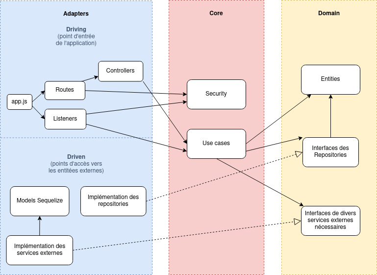
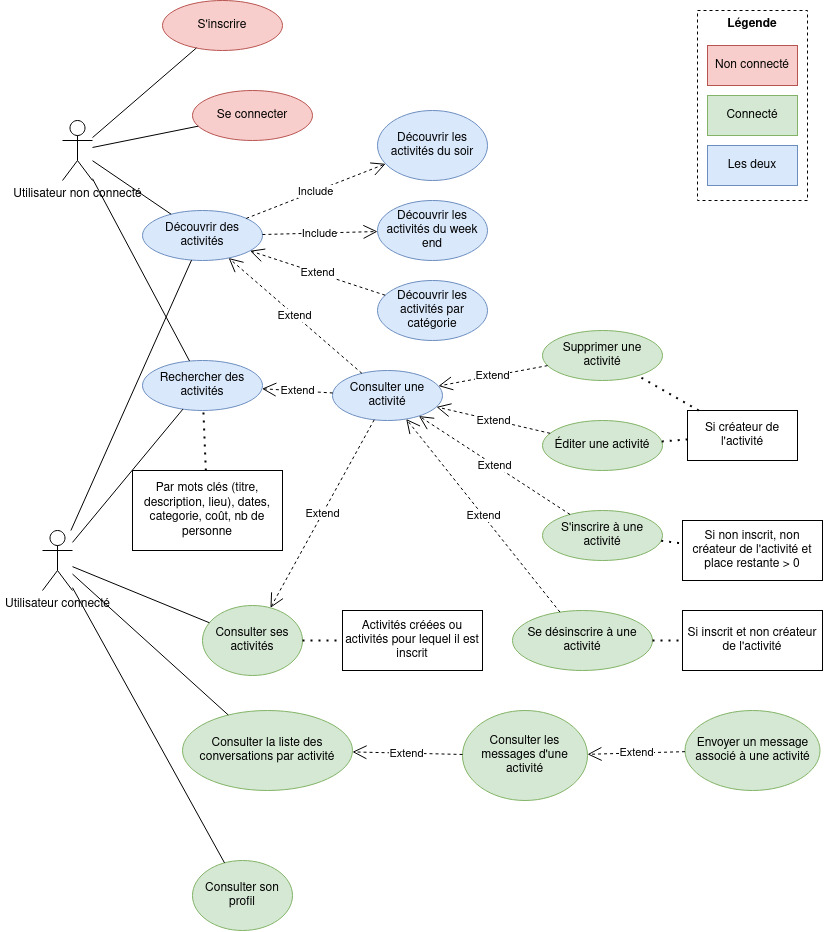

# I. Objectifs du projets
BuddyBazaar est une application qui vous aide à découvrir de nouvelles activités et à entrer en contact avec d'autres personnes qui partagent vos centres d'intérêt autour de vous.

Les objectifs du projets sont de :
- Permettre à des utilisateurs de créer des activités et de les partager avec d'autres utilisateurs
- Permettre à des utilisateurs de s'inscrire à des activités créées par d'autres utilisateurs
- Permettre à des utilisateurs de communiquer entre eux via des messages
- Permettre à des utilisateurs de découvrir des activités via une recherche par catégorie, par date, par lieu, etc.

# II. Démo 
- L'apk est disponible parmis les artéfacts Gitlab : [apk](https://gitlab.com/grenoble-inp-ensimag/4MM1CAW/ProjetCAW/BuddyBazaar_antoine_klein3_david_gelinotte_viviane_qian/-/jobs/artifacts/main/download?job=build+front)

(screencast)
TODO : à faire

Étapes :
- Découvrir : 
    - Liste des activités : montrer les activités ce soir et ce weekend + recherche via les boutons catégories
    - Recherche d'activités : montrer la recherche par nom, par catégorie, par date, par lieu... (à voir si on fait plus ou moins court)
- Inscription
- Connexion :
    - Créer une activité : 
        - Appel api adresse
    - Editer une activité
    - Consulter et s'inscrire à une activité :
        - Envoyer un message
    - Supprimer une activité
    - Afficher page profil
- Notification

# III. Installation, exécution des tests et documentation de l'API
- Backend : [README du backend](./backendsqlite/README.md)
- Frontend : [README du frontend](./frontend/README.md)

# IV. Architecture
## A. Frontend
### 1. Description
Certaines bibliothèques utilisées nous ont guidés dans les choix d'architecture en front :
- Redux : pour la gestion de l'état global de l'application
- React-Native : pour la gestion de l'UI
- React-Navigation : pour la gestion de la navigation entre les pages

L'organisation des composants a été grandement influencée par le mode de navigation avec une séparation entre des pages et des sous-pages.

Pour ce qui est de la gestion des données de l'application et les appels vers de services externe, on se repose sur Redux et les pratiques usuelles.

### 2. Pages
Le répertoire _pages_ contient les éléments de _navigation_ et les _pages_ de l'application.\
La navigation est gérée par _react-navigation_ et se fait via une barre de navigation en bas de l'écran. L'organisation des pages est la suivante :
- navigation :
    - screen1
        - main1
            - sub1
            - sub2
    - screen2
        - main2
            - sub3
            - sub4

Les pages accessibles depuis la barre de navigation sont dans _main_ tandis que les pages accessibles seulement depuis d'autres pages sont dans _sub_.

### 3. Components
Le répertoire _components_ contient les composants réutilisables de l'application qu'on retrouve dans plusieurs pages.

### 4. Store
Le répertoire _store_ contient les éléments de gestion de l'état global de l'application.
On y retrouve :
- les _slices_ : contiennent les _state_ du store et les _reducers_ qui permettent de modifier les _state_.
- les _thunks_ : contiennent les fonctions qui vont faire des appels vers des services externes et modifier les _state_ via les _reducers_.

## B. Backend
### 1. Description
L'architecture du backend est largement inspirée de l'architecture hexagonale. Le but principale d'une telle architecture est de concevoir un logiciel modulable, testable et indépendant des systèmes externes (frameworks, UI, BDD, etc.). Pour cela on se repose notemment sur les principes SOLID.

Schéma de l'architecture :\

### 2. Domain
Le _domain_ contient les _entities_, c'est-à-dire le modèle des données qu'on va manipuler et les _interfaces_ qui définissent les contrats d'utilisation des systèmes externes.

- Entities/Models :\

- Interfaces : 
    - repositories : accès aux tables de la base de données
    - services divers (chiffrage, etc.)

### 3. Core
Le _core_ contient le coeur de l'application, là où se trouve toute la logique métier. Elle est isolée des dépendances externes et est donc plus facilement testable. Elle est découpée en _use cases_ (cas d'usage) et chacun d'eux représente une fonctionnalité. Le paramétrage se fait via les _entities_ du métier qui vont être manipulés et les _interfaces_ qui permettent de changer d'implémentation en fonction du besoin (par exemple, utiliser des inMemory ou fake lors des tests). Le _core_ contient aussi un répertoire _security_ qui porte sur toute la gestion des règles métiers d'accès aux routes du backend et donc aux _use cases_.

- Use cases :
    - User
        - RegisterUser : Inscrire un utilisateur
        - SignInUser : Connecter un utilisateur
    - Activity :
        - CreateActivity : Créer une activité
        - DeleteActivity : Supprimer une activité
        - GetActivities : Récupérer les activités (toutes ou certaines avec filtres)
        - GetActivitiesByUser : Récupérer toutes les activités liées à un utilisateur (détenteur ou participant)
        - GetActivityById : Récupérer une activité par son id interne
        - UpdateActivity : Mettre à jour une activité
    - ActivityRegistration :
        - RegisterForAnActivity : S'inscrire à une activité (qui n'appartient pas à l'utilisateur)
        - UnregisterForAnActivity : Se désinscrire à une activité (qui n'appartient pas à l'utilisateur)
    - Message :
        - CreateMessage : Créer un message
        - GetLastMessagesByUserId : Récupérer le dernier message envoyé ou reçu de chaque activité de l'utilisateur (détenteur ou participant)
        - GetMessagesByAcivityId : Récupérer tous les messages concernant une activité

- Diagramme de cas d'utilisation :\

- Gestion des utilisateurs dans _security_ :
    - les _Actions_ possible pour l'utilisateur : create, read, update, readone, delete
    - les _Resources_ disponibles sur l'application : activity, user, message
    - les _rbacCheckFunctions_ qui contiennent un ensemble de fonctions de vérification de droit d'accès
    - les _rbacRules_ qui sont sous la forme d'un dictionnaire dont la combinaison des _Actions_ et des _Resources_ correspond à une _rbackCheckFunctions_ à exécuter
    - le _can_ où l'on retrouve les fonctions vérifiant l'authentification de l'utilisateur et faisant appel aux _rbacRules_ pour vérfier le droit d'accès. Ces fonctions sont utilisées en tant que middleware sur les routes du backend et sur les listeners des sockets

### 4. Adapters
Les _adapters_ contient les implémentations répondant aux contrats d'utilisation (_interfaces_) du coeur de notre application.
Il existe deux catégories d'_adapters_ :
- Driving : c'est ce qui réunit les points d'entrée d'une application. Donc on y retrouve dans notre cas les _routes_ de notre API et les _controllers_ ainsi que les _listeners_ de socket. Les _interfaces_ de ce cas ne sont pas définit concrètement mais on peut les voir comme les signatures des _use case_. 
- Driven : ce sont les _adapters_ qui seront utilisés par l'application. On y retrouve donc l'accès à la base de données ou encore l'usage de bibliothèques externes.

### 5. Testabilité
- Tests unitaires (spec)\
La portée de ces tests ne s'arrête qu'au use cases (donc une fonctionnalité), c'est pour cela qu'on substitue les implémentations concrètes par des fakes. Leur objectif est de documenter les comportements métiers de notre application à travers des exemples de scénarios. Ils sont aussi indépendants des uns des autres et sont donc exécutables en parallèle.

- Tests d'intégration (integ)\
Ces tests ont simplement pour objectif de vérifier que les adapters respectent les contrats définis dans l'application. Donc on va faire appel ici à une vraie base de données et aux services réels pour les driven adapters. Dans le cas des driving adapters, les tests API permet de vérifier que nos controllers passent les bonnes informations à nos use cases.

- Tests end-to-end (e2e)\
Comme l'indique le nom, ce sont des tests bout en bout qui vérifient que l'API du backend retourne bien ce qui est attendu et qui passent donc à travers toutes les couches de l'architecture. Dans notre cas, la couverture est faite via les tests API.

## C. Webservices utilisés
- API adresse du gouvernement (https://adresse.data.gouv.fr/api-doc/adresse)\
Cette API nous permet de trouver l'emplacement réel à partir d'une adresse ou d'un nom de lieu. Elle est utilisée pour la création d'activité afin d'enregistrer les coordonnées GPS de l'activité pour permettre l'affichage sur une carte.
L'appel à cet API ce fait directement dans le front (dans /store/thunks/franceAPIThunk.js) lorsque l'utilisateur rentre une adresse dans le formulaire de création d'activité.
- API de photos (https://picsum.photos)
Cette API nous permet de récupérer une image aléatoire à partir d'un identifiant. Elle est utilisée pour afficher une image aléatoire pour chaque activité. C'est surtout pour des raisons esthétiques et pour ne pas avoir à stocker des images sur notre serveur. Les appels sont directement fait dans les composant nécessitant une image aléatoire (dans /components/ActivityCard.js, /pages/sub/ActivityDetails.js et /pages/main/MessagesPage.js).
